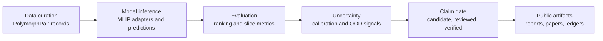

# CrystalProbe Case Study

CrystalProbe is an open research tool for reliable molecular prediction workflows. The mission is ambitious: make AI-assisted molecular discovery more trustworthy and easier to audit. The claims are conservative: this repository is not a finished drug-discovery engine and does not yet make headline polymorph benchmark claims from unverified records.

## Problem

Molecular prediction systems can produce numbers long before those numbers are scientifically safe to use. A model may rank two crystal forms, estimate an energy gap, or flag a structure as unusual, but a real research workflow still has to answer harder questions:

- Where did the structures come from?
- Are the records licensed for public release?
- Is the experimental stability ordering known, cited, and unambiguous?
- Are model energies being compared within a valid scope?
- Does the workflow separate exploratory candidates from benchmark-ready evidence?

CrystalProbe exists to make those questions explicit and testable.

## Scientific Background

Many medicines can appear in more than one solid form. These forms can differ in stability, solubility, manufacturability, storage behavior, and formulation risk. That makes solid-form prediction relevant to drug discovery even though it is not the same task as target biology, protein-ligand docking, or binding affinity prediction.

The current system focuses on polymorph-pair evaluation. A polymorph pair compares two crystal structures for the same molecule and asks whether a model ranks the experimentally more stable form lower in predicted energy. That simple question becomes difficult in practice because structure sources, evidence quality, disorder annotations, and licensing constraints all affect whether the result can be used publicly.

## Architecture

CrystalProbe uses one shared contract across curation, inference, evaluation, uncertainty, and publication artifacts.



The key design choice is that the claim gate is not an afterthought. Draft records may contain placeholders so research can begin early. Reviewed and verified records are stricter, and verified records are the only safe basis for headline benchmark claims.

## Public Demo

The clean demo command is:

```powershell
python scripts\run_public_demo.py --backend-smoke auto
```

The reviewer-facing artifact command is:

```powershell
python scripts\build_public_artifact.py
```

The candidate molecule viewer command is:

```powershell
python scripts\build_molecule_viewer_report.py
```

The evidence atlas command is:

```powershell
python scripts\build_evidence_atlas.py
```

The energy and molecule stress-test commands are:

```powershell
python scripts\build_molecule_bug_hunt_database.py
python scripts\build_energy_verification_report.py
.\.venv\Scripts\python.exe scripts\build_conformer_generation_report.py
.\.venv\Scripts\python.exe scripts\build_backend_ready_inputs.py
.\.venv\Scripts\python.exe scripts\build_backend_smoke_report.py --limit 1 --backends mace aimnet2
.\.venv\Scripts\python.exe scripts\build_tentative_molecule_benchmark.py
```

The public artifact integrity check is:

```powershell
python scripts\check_public_artifact.py
```

The command runs the dependency-light benchmark path, writes a provenance ledger, generates fingerprint and calibration reports, and checks optional scientific backend availability. When MACE or AIMNet2 are installed with ASE, the demo attempts a small H2O backend smoke test within a timeout. If those scientific stacks are missing, the demo still completes and records the missing dependencies instead of pretending the backend path was exercised.

Generated outputs:

- `outputs/public_demo/public_demo_report.md`
- `outputs/public_demo/public_demo_report.json`
- `outputs/public_demo/fingerprint_report.md`
- `outputs/public_demo/fingerprint_report.json`
- `outputs/public_demo/calibration_report.json`
- `outputs/public_demo/public_demo_ledger.jsonl`
- `outputs/public_demo/figures/claim_gate.svg`
- `outputs/public_demo/figures/pipeline.svg`
- `outputs/public_demo/figures/backend_readiness.svg`
- `outputs/public_demo/figures/provenance_ledger.svg`
- `outputs/public_demo/figures/calibration_reliability.svg`
- `outputs/public_demo/figures/energy_uncertainty.svg`
- `docs/public_demo.md`
- `docs/assets/public_demo/*.svg`
- `docs/molecule_viewers.md`
- `docs/viewers/paracetamol_form_i_vs_form_ii_seed.html`
- `outputs/crystalprobe_evidence_atlas.sqlite`
- `outputs/crystalprobe_evidence_atlas.md`
- `docs/evidence_atlas.md`
- `docs/evidence_atlas.html`
- `outputs/crystalprobe_energy_verification.md`
- `outputs/crystalprobe_conformer_generation.md`
- `outputs/crystalprobe_backend_ready_inputs.md`
- `outputs/crystalprobe_backend_smoke.md`
- `outputs/crystalprobe_molecule_bug_hunt.sqlite`
- `docs/molecule_bug_hunt.md`
- `outputs/crystalprobe_tentative_molecule_benchmark.sqlite`
- `docs/tentative_molecule_benchmark.md`
- `outputs/public_artifact_integrity.md`
- `outputs/public_artifact_integrity.json`

## Benchmark Result Table

The current public seed manifest is intentionally honest. It exercises the workflow contract, but it is not a verified scientific benchmark.

| Evidence label | Current role | Public records | Headline benchmark claim |
|---|---|---:|---|
| candidate | Draft seed records and local inspection queues | 5 seed pairs | Blocked |
| reviewed | Human-reviewed records without TODO contamination | 0 | Blocked for headline claims |
| verified | Evidence-complete records with unambiguous stability ordering | 0 | Required before claims |

This table is a feature, not a weakness. The tool is designed to show when the answer is "not ready yet."

## Visualization Module

The public demo writes deterministic SVG figures instead of relying on notebook state. The first set is deliberately focused on reliability rather than decorative chemistry:

- `claim_gate.svg`: candidate, reviewed, and verified record counts with the current benchmark-claim decision.
- `pipeline.svg`: data curation -> model inference -> evaluation -> uncertainty -> claim gate -> public artifacts.
- `backend_readiness.svg`: optional backend import and smoke-test status.
- `provenance_ledger.svg`: manifest, predictions, generated reports, and ledger path.
- `calibration_reliability.svg`: calibration plot, including an honest empty state when no verified calibration points exist.
- `energy_uncertainty.svg`: energy gap versus combined uncertainty, with each point labeled by molecule name and curation status such as `draft/unverified`.

The gallery in `docs/public_demo.md` embeds stable copies of these SVGs from `docs/assets/public_demo/` so the visual story is available directly from a repository browser.

The molecule viewer registry in `docs/molecule_viewers.md` adds source-hosted COD/JSmol viewer links for candidate structures. The generated HTML page at `docs/viewers/paracetamol_form_i_vs_form_ii_seed.html` can display the remote COD pages when a browser permits embedding, but it does not embed CIF text or atom coordinates and keeps every structure labeled `candidate_unverified`.

The Evidence Atlas in `docs/evidence_atlas.html` is the database-facing version of the same philosophy: molecules, polymorph pairs, structures, evidence sources, blockers, predictions, viewer links, and release-boundary artifacts are searchable from one static page and queryable from `outputs/crystalprobe_evidence_atlas.sqlite`.

The energy verification report, conformer-generation bridge, backend-ready input manifest, backend smoke benchmark, molecule bug-hunt database, and tentative molecule benchmark add a QA layer for weird failures before they become scientific claims: salts, charges, stereochemistry, hydrates, duplicate-connectivity cases, OOD prediction rows, missing uncertainty, missing predictions, optional-backend blockers, parser failures, generated-conformer blockers, host compiler blockers, and non-verified energy rows are visible rather than silently passing through the system.

## Public Review Checklist And Stronger Candidate

The public artifact now includes two reviewer-facing additions:

- `docs/public_demo_checklist.md`: expected runtime, required dependencies, optional backend behavior, output checklist, claim checks, and manual public-sharing review.
- `docs/cases/cposs_ibp_candidate.md`: a stronger unverified CPOSS candidate example for `ibp_ibp01_psicrys_vs_ibp06_psicrys`, with source context, backend output summaries, explicit blockers, and no coordinate-bearing source content.

The IBP candidate is intentionally labeled `candidate_unverified`. It is useful because three local backend summaries rank `IBP01_PsiCrys` lower than `IBP06_PsiCrys`, but it remains blocked from verified benchmark use until experimental stability evidence, source-license review, disorder annotation, block-form mapping, curator, and reviewer fields are complete.

The integrity checker verifies that the public docs and copied SVG assets exist, candidate/unverified labels are visible, no coordinate-style files are present in public asset directories, and every public artifact path is classified as `candidate_public` by the release-boundary policy.

## Results

The sample prediction file demonstrates the mechanics of pairwise scoring, uncertainty inputs, OOD flags, report generation, and ledger creation. Because the seed records use ambiguous experimental stability ordering, the quick benchmark skips them for accuracy scoring. That is the correct behavior: ambiguous records should not silently become benchmark evidence.

When optional scientific backends are installed, the public demo can also record whether backend smoke tests pass. Backend availability is not treated as proof of scientific validity; it is treated as execution evidence.

## Limitations

- Current CPOSS-derived records remain candidate-only until stability evidence, licensing decisions, disorder annotations, curator fields, and reviewer fields are complete.
- Raw or coordinate-bearing CCDC/CSD-derived artifacts are not public release artifacts unless licensing review explicitly permits redistribution.
- Absolute energies from different model backends are not treated as directly commensurate.
- Backend disagreement is an inspection signal, not a calibrated thermodynamic uncertainty estimate.
- Generated-conformer backend smoke results are execution evidence only; they are tagged `candidate_unverified` and cannot promote a molecule into benchmark status.
- The current project is strongest as reliability infrastructure for molecular prediction, not as a standalone crystal structure prediction engine.

## Next Steps

1. Promote a small set of records from candidate to reviewed by completing source, license, disorder, and citation fields.
2. Reach the first verified benchmark slice with unambiguous experimental stability evidence.
3. Keep the public demo under five minutes while adding optional backend smoke coverage for UMA when a safe fixture is available.
4. Publish a license-safe case-study bundle that includes manifests, generated reports, ledgers, and exact rebuild commands.
5. Add a separate protein-ligand or binding-affinity bridge notebook later, using open data, without diluting the current solid-form reliability story.

## What Molecular Prediction Systems Must Prove Before They Are Useful In Drug Discovery

Drug discovery does not need only better model outputs. It needs prediction systems whose outputs can survive scientific pressure.

A useful molecular prediction system should prove five things. First, provenance: every structure, label, model checkpoint, and generated artifact should be traceable. Second, evidence quality: exploratory records should not be mixed with verified benchmark records. Third, uncertainty discipline: confidence, OOD behavior, and backend disagreement should be reported instead of hidden. Fourth, claim scope: the system should say exactly what a result does and does not support. Fifth, reproducibility: another researcher should be able to rerun the workflow and recover the same decision boundary.

CrystalProbe is built around that point of view. It aims to be an open, reliable research tool that helps molecular prediction work become more auditable before it becomes more ambitious.
