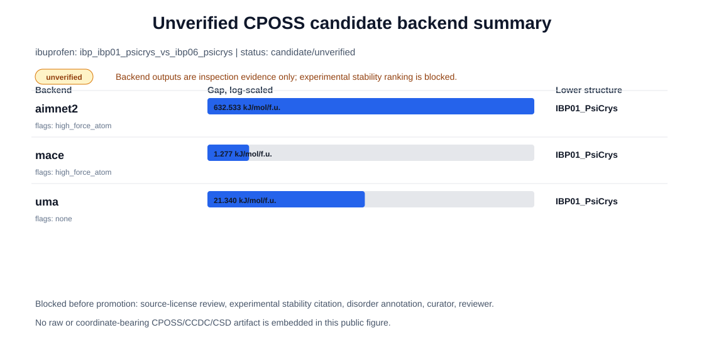

# Public Candidate Case: ibp_ibp01_psicrys_vs_ibp06_psicrys

Status: `candidate_unverified`
Evidence tier: `exploratory_local_measurement`
Family: `IBP`
Common name: `ibuprofen`

This is a stronger unverified example for CrystalProbe's public artifact. It includes source context, model-output summaries, and explicit blockers, but it is not a verified benchmark record.

## Visual Summary

## Source Context

- Source family is CPOSS209 metadata used for CrystalProbe curation planning.
- The public artifact stores only metadata and model-output summaries.
- Raw or coordinate-bearing source structures remain outside the public artifact until licensing is resolved.
- The pair compares IBP01_PsiCrys and IBP06_PsiCrys after formula-unit normalization.

## Why This Case

- It is a high-priority CPOSS candidate in the local triage queue.
- All three checked backends ranked IBP01_PsiCrys lower than IBP06_PsiCrys.
- The MACE normalized gap is small, making it useful for uncertainty and curation triage.
- The high-force diagnostic flag keeps the example honest: model agreement still needs inspection.

## Model Output Summary

| Backend | Lower structure | Higher structure | Gap (kJ/mol/f.u.) | Diagnostic flags |
|---|---|---|---:|---|
| `aimnet2` | `IBP01_PsiCrys` | `IBP06_PsiCrys` | 632.533 | high_force_atom |
| `mace` | `IBP01_PsiCrys` | `IBP06_PsiCrys` | 1.277 | high_force_atom |
| `uma` | `IBP01_PsiCrys` | `IBP06_PsiCrys` | 21.340 | none |

## Claim Boundary

- Do not use as experimental stability evidence.
- Do not use as a verified polymorph benchmark record.
- Do not present backend agreement as proof of thermodynamic truth.
- Do not redistribute raw or coordinate-bearing source files through the public artifact.

## Promotion Blockers

- Experimental stability ordering is not recorded.
- Primary stability citation is missing.
- Source-license decision is unresolved.
- Disorder annotation is missing for both structures.
- Block-form mapping is not locked.
- Curator and reviewer fields are missing.

## Next Actions

- Find and attach primary experimental stability evidence with DOI or durable URL.
- Resolve source redistribution license before any coordinate-bearing public artifact.
- Lock block-form mapping for both structures with curator and reviewer fields.
- Record disorder annotations for both structures.
- Inspect high-force diagnostics before using the local model gap in a qualitative narrative.

## Public Sharing Notes

- This page is metadata and model-output summary only.
- Do not copy raw CPOSS, CCDC, or CSD coordinate-bearing files into this public artifact.
- Keep this case below verified benchmark status until all promotion blockers are resolved.
