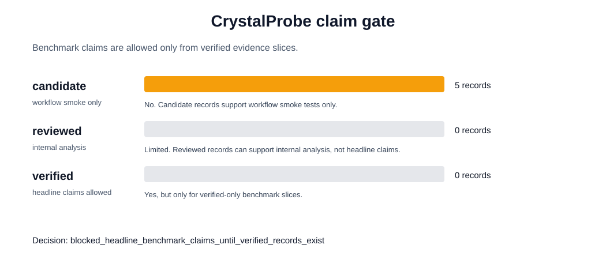
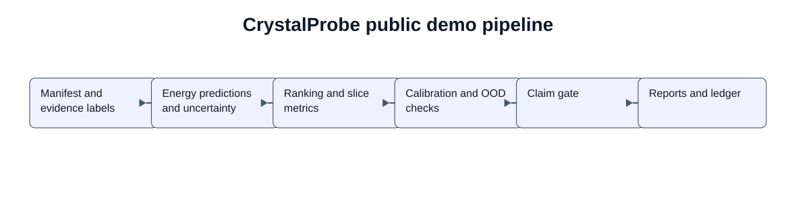
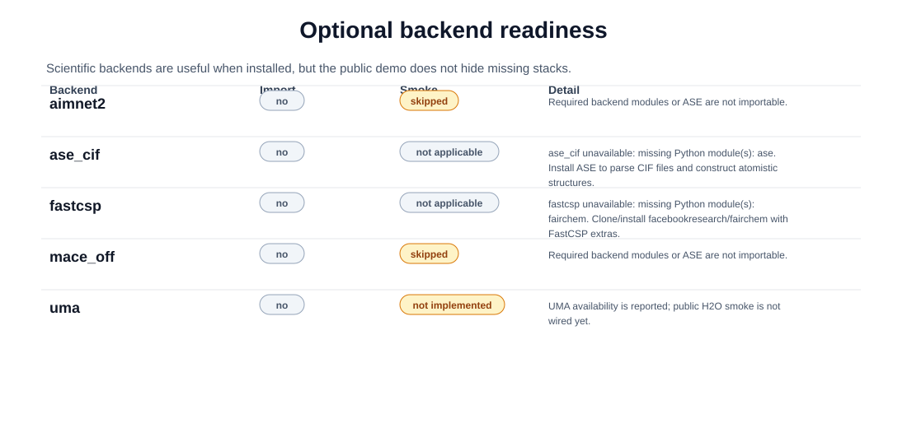
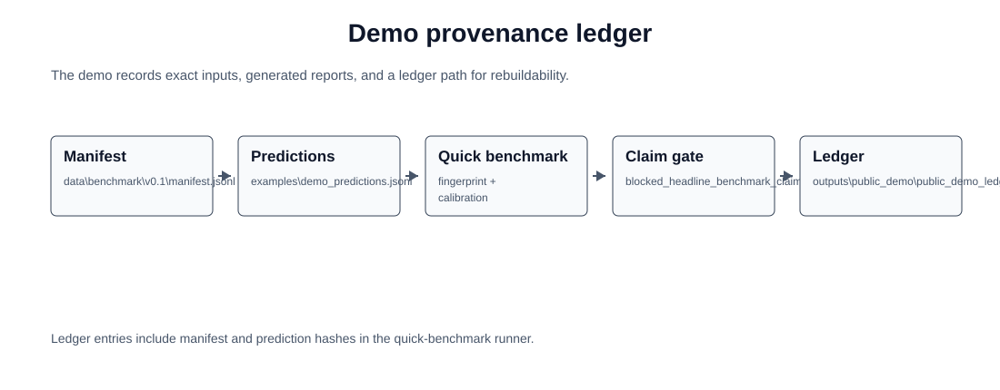
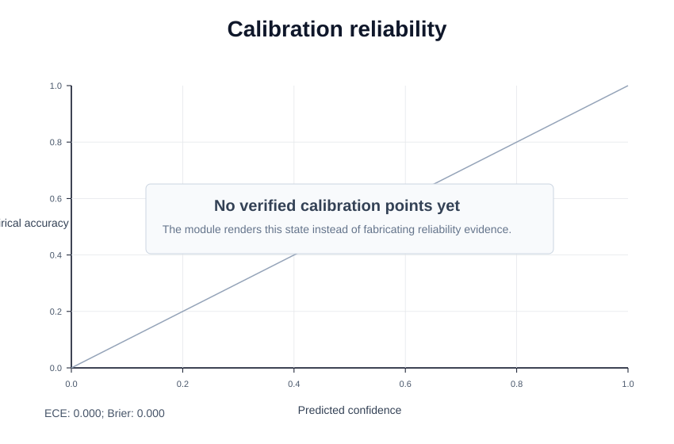
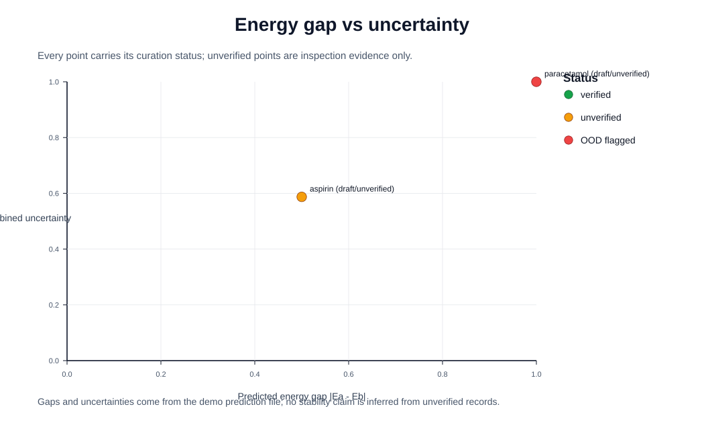

# CrystalProbe Public Demo Gallery

This gallery is the reviewer-facing view of the public demo. The SVGs are copied from the generated demo output into `docs/assets/public_demo/` so they remain visible even though `outputs/` is ignored.

## Rebuild

```powershell
python scripts\build_public_artifact.py
python scripts\check_public_artifact.py
```

- Demo command: `python scripts/run_public_demo.py --backend-smoke auto`
- Claim gate: `blocked_headline_benchmark_claims_until_verified_records_exist`
- Pairs: `5`
- Evaluated: `0`
- Skipped: `5`
- Checklist: [`docs/public_demo_checklist.md`](public_demo_checklist.md)
- Stronger unverified case: [`docs/cases/cposs_ibp_candidate.md`](cases/cposs_ibp_candidate.md)

## Visual Summary

### Claim Gate



### Reliability Pipeline



### Backend Readiness



### Provenance Ledger



### Calibration Reliability



### Energy Gap And Uncertainty



## Interpretation

- The claim gate blocks headline benchmark claims because the public seed records are draft/candidate evidence.
- The calibration figure intentionally shows an empty verified-points state instead of inventing reliability evidence.
- The energy/uncertainty figure labels current points as `draft/unverified`, so candidate data stays visibly separate from benchmark truth.
- Optional backend status is execution evidence only; installed scientific stacks are useful but not required for the public demo to complete.

## Generated Reports

- Public demo report: `outputs\public_demo\public_demo_report.md`
- Fingerprint report: `outputs\public_demo\fingerprint_report.md`
- Calibration JSON: `outputs\public_demo\calibration_report.json`
- Ledger: `outputs\public_demo\public_demo_ledger.jsonl`
